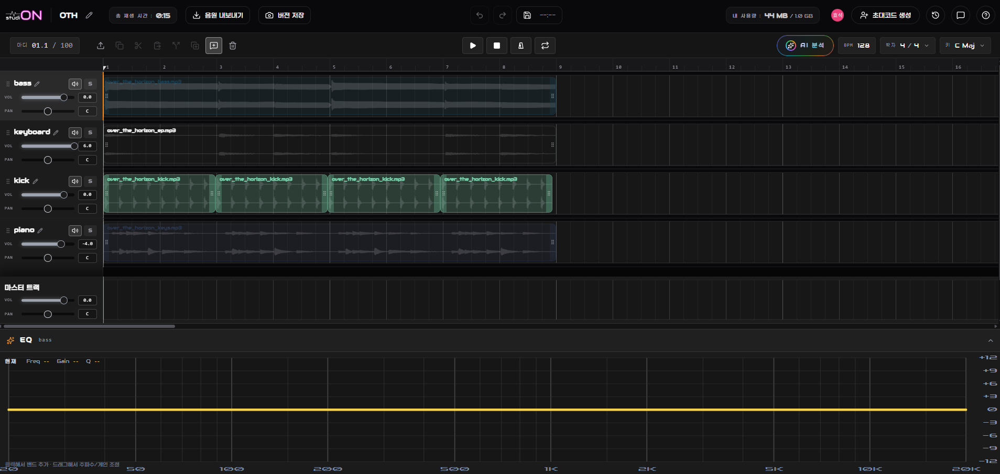

<div align="center">


# studiON

### 당신이 있는 곳 어디든, 스튜디오가 되다

<p align="center">
  <strong>studiON</strong>은 음악 작업자가 브라우저에서 오디오 파일을 함께 확인하고,<br/>
  AI 오디오 분석을 통해 충돌·클리핑·하쉬니스 문제를 빠르게 발견할 수 있도록 설계된<br/>
  <strong>AI 오디오 분석 기반 실시간 음원 협업 서비스</strong>입니다.
</p>

[발표 자료](./FE/public/studiON.pdf)

</div>

---

## Preview

<p align="center">
  <video src="./FE/public/md.mp4" width="100%" controls></video>
</p>

---

## 기획 배경

하나의 음악을 완성하기 위해 작곡가와 프로듀서, 보컬, 엔지니어는 여러 개의 오디오 파일을 주고받고,
각 파일을 합쳐 들어보며, 문제가 되는 구간을 확인하고, 다시 피드백을 전달하는 과정을 반복합니다.

하지만 실제 협업 과정에서는 음악을 만드는 시간만큼이나 파일을 관리하고 확인하는 시간이 많이 발생합니다.
작업자는 파일을 다운로드하고, DAW에서 직접 불러오고, 여러 트랙을 합쳐 들으며, 이상한 소리가 나는 구간을 직접 찾아야 합니다.

특히 여러 명이 동시에 작업할수록 파일 버전이 많아지고, 피드백 위치를 정확히 공유하기 어려워집니다.
“어느 파일의 몇 초 구간에서 어떤 문제가 발생했는지”를 설명하기 위해 별도의 메신저와 파일 공유 도구를 함께 사용해야 하는 경우도 많습니다.

또한 클리핑, 대역 충돌, 하쉬니스처럼 청각적으로 확인해야 하는 문제는 초보 작업자에게 더 큰 부담이 됩니다.
문제를 발견하더라도 원인을 파악하기 어렵고, 어떤 방식으로 수정해야 하는지 판단하기까지 시간이 필요합니다.

studiON은 음악 작업자가 브라우저에서 오디오 파일을 함께 확인하고,
AI 분석을 통해 문제가 될 수 있는 구간을 빠르게 파악하며,
구간 기반 코멘트로 피드백을 주고받을 수 있도록 돕습니다.

<strong>음악 작업자가 반복적인 확인 과정보다 창작에 더 집중할 수 있는 협업 환경을 목표로 합니다.</strong>

---

## 문제 정의 & 솔루션

### 문제

- 오디오 파일을 확인하기 위해 매번 다운로드하고 별도 프로그램에서 열어야 함
- 여러 트랙을 합쳐 들으며 클리핑, 충돌, 하쉬니스 문제를 직접 찾아야 함
- 피드백을 전달할 때 정확한 구간과 수정 내용을 함께 공유하기 어려움
- 파일 버전과 코멘트가 분리되어 협업 상황을 한눈에 파악하기 어려움
- 초보 작업자는 오디오 문제의 원인과 수정 방향을 판단하기 어려움

### 해결

- 브라우저 기반 프로젝트 공간에서 오디오 파일을 업로드하고 함께 확인할 수 있는 환경 제공
- AI 오디오 분석을 통해 대역 충돌, 클리핑, 하쉬니스 후보 구간 탐지
- 타임라인 기반 코멘트, 멘션, 해결 상태 관리로 구간별 피드백 흐름 지원
- 프로젝트, 트랙, 버전, 코멘트를 하나의 작업 공간에서 관리
- EQ 제안과 분석 결과를 통해 사용자가 수정 방향을 이해할 수 있도록 지원

### 핵심 가치

- **협업성**: 오디오 파일, 코멘트, 분석 결과를 하나의 프로젝트 안에서 함께 관리
- **분석성**: AI가 문제가 될 수 있는 오디오 구간을 탐지하고 수정 판단을 보조
- **효율성**: 다운로드와 반복 확인 과정을 줄이고 브라우저에서 바로 작업 흐름을 이어갈 수 있도록 지원

---

## 차별점

### 브라우저 기반 오디오 협업 환경

studiON은 별도의 DAW나 파일 다운로드 없이 브라우저에서 오디오 파일을 확인할 수 있는 작업 공간을 제공합니다.
사용자는 프로젝트를 생성하고, 팀원을 초대하고, 업로드된 트랙을 함께 들으며 협업을 진행할 수 있습니다.

### 타임라인 기반 코멘트

오디오의 특정 마디와 구간에 직접 피드백을 남길 수 있습니다. 텍스트 피드백이 실제 소리의 어느 부분을 가리키는지 바로 확인할 수 있습니다.

### AI 오디오 분석

AI 서버가 믹싱 과정에서 발생할 수 있는 주파수 충돌, 클리핑, 하쉬니스 문제 등을 분석합니다. 분석 결과는 시각화되어 사용자가 문제 구간을 빠르게 파악할 수 있습니다.

### AI EQ 제안

분석 결과를 바탕으로 EQ 조정 방향을 제안합니다. 사용자는 제안값을 확인하고 적용 전후를 비교하며 최종 판단할 수 있습니다.

---

## 주요 기능

### 1. 프로젝트 기반 협업

사용자는 프로젝트를 생성하고 팀원을 초대해 하나의 작업 공간에서 음악 작업을 진행할 수 있습니다.

- 프로젝트 생성 및 초대
- 트랙 단위 작업
- 실시간 협업 상태 공유
- 프로젝트 목록 및 진행 상태 관리

### 2. 타임라인 코멘트

오디오 타임라인의 특정 구간에 코멘트를 남기고, 작업 맥락에 맞는 피드백을 주고받을 수 있습니다.

- 구간 단위 코멘트 작성
- 코멘트 상태 관리
- 멤버 멘션
- 실시간 피드백 확인

### 3. 오디오 버전 관리

작업 결과물을 버전 단위로 저장하고 비교할 수 있습니다.

- 마스터 오디오 버전 저장
- 업로드 및 다운로드 URL 발급
- 버전 목록 조회
- 렌더링 상태 관리

### 4. AI 오디오 분석

AI가 오디오를 분석해 믹싱 문제를 자동으로 탐지합니다.

- 주파수 충돌 분석
- 클리핑 탐지
- 치찰음 탐지
- 위상 및 밸런스 문제 탐지

### 5. AI EQ 제안

분석된 문제 구간에 대해 EQ 조정안을 제안하고, 사용자가 적용 여부를 판단할 수 있도록 돕습니다.

- 문제 구간 시각화
- EQ 적용 전후 비교
- 추천 gain 및 frequency 범위 제공
- 사용자 피드백 기반 보정

---

## 서비스 화면

### 온보딩

서비스 소개와 초기 사용자 경험을 제공합니다.


<br/>

### 대시보드

프로젝트 생성, 참여, 목록 관리를 제공합니다.


<br/>

### 프로젝트 편집

오디오 트랙, 클립, 재생 컨트롤, 코멘트를 한 화면에서 다룹니다.



<br/>

### 타임라인 코멘트

구간별 피드백을 작성하고 확인합니다.


<br/>

### AI 분석

AI 분석 결과와 문제 구간을 확인합니다.


<br/>

### AI EQ 제안

AI가 제안한 EQ 조정 방향을 검토합니다.


---

## 기술 스택

| 영역 | 기술 |
| --- | --- |
| Frontend | Vue 3, TypeScript |
| Backend | Spring Boot, Java 21 |
| AI | FastAPI, Python |
| Database / Cache | MySQL, MongoDB, Redis |
| Infra | Docker, Nginx, Jenkins |

---

## 아키텍처 개요

studiON은 Frontend, Backend, AI Server를 분리한 구조로 구성됩니다.

<p align="center">
  
</p>

### 주요 설계 포인트

- **Frontend**: 프로젝트 편집, 타임라인, 코멘트, EQ UI를 제공하는 Vue 기반 클라이언트입니다.
- **Backend**: 인증, 프로젝트, 트랙, 클립, 코멘트, 오디오 버전, 실시간 협업 API를 담당합니다.
- **AI Server**: 오디오 분석, AI 제안 생성, 비동기 워크플로우 처리를 담당합니다.
- **Storage**: 관계형 데이터, 이벤트성 문서, 캐시 데이터를 목적에 맞게 분리해 저장합니다.

---

## 모노레포 구조

```text
.
├── FE/                  # Vue 기반 프론트엔드
├── BE/                  # Spring Boot 백엔드
├── AI/                  # FastAPI 기반 AI 서버
├── INFRA/               # 인프라 설정
├── docs/                # 설계 문서
├── exec/                # 포팅 및 제출 문서
├── compose.dev.yaml     # 로컬 개발용 Docker Compose
├── compose.ai.yaml      # AI 서버용 Docker Compose
├── compose.prod.yaml    # 운영 배포용 Docker Compose
└── README.md
```

---

## 실행 방법

### 사전 요구사항

- JDK 21+
- Node.js 22+
- Python 3.11
- Docker / Docker Compose
- uv

### 개발용 인프라 실행

```bash
docker compose -f compose.dev.yaml up -d
```

### Backend 실행

```bash
cd BE
./gradlew bootRun
```

### Frontend 실행

```bash
cd FE
npm install
npm run dev
```

### AI Server 실행

```bash
cd AI
uv sync
uv run uvicorn app.main:app --reload --host 0.0.0.0 --port 8000
```

### AI Worker 실행

```bash
cd AI
uv run python -m dramatiq app.services.workflow_queue
```

---

## 프로젝트 산출물

- [시스템 아키텍처](./docs/architecture/system.-overview.md)
- [검증 플로우](./docs/design-docs/validation-flow.md)
- [핵심 설계 문서](./docs/design-docs/core-beliefs.md)
- [기술 부채 정리](./docs/exec-plans/tech-debt.md)
- [포팅 매뉴얼](./exec/포팅_매뉴얼.pdf)
- [최종 발표 자료](./FE/public/studiON.pdf)

---

## 회고

이번 프로젝트에서 가장 중요하게 생각한 목표는 실제 사용자를 만나 문제를 정의하는 경험이었습니다. studiON은 음악 협업이라는 특수한 도메인의 문제를 다루고 있었기 때문에, 기획자의 가정만으로는 서비스의 필요성을 충분히 설명하기 어렵다고 판단했습니다. 그래서 기획 초기부터 실용음악과 출신 팀원의 실제 작업 과정을 관찰하고, 음악 작업 경험이 있는 사용자들을 대상으로 설문과 인터뷰를 진행했습니다.

사용자 조사를 진행할 때는 우리의 기획 방향으로 답변을 유도하지 않기 위해 주의했습니다. 특정 기능의 필요성을 묻기보다, 실제 작업 방식, 파일 공유 과정, 피드백 전달 방식, 각 과정에서 느끼는 불편함과 그 이유를 중심으로 질문했습니다. 이를 통해 사용자가 실제 협업 과정에서 겪는 문제를 바탕으로 서비스를 바라볼 수 있었습니다.

초기에는 파일 공유와 피드백의 어려움이 서로 다른 설치형 DAW를 사용한다는 점에서 비롯된다고 판단했습니다. 그래서 웹 기반 DAW에 가까운 작업 환경을 제공하면 문제를 근본적으로 해결할 수 있을 것이라고 생각했습니다. 하지만 DAW를 직접 개발하는 것은 8주라는 제한된 기간 안에서 범위가 너무 컸고, 기존 DAW가 가진 가상악기, 플러그인, 작업 방식, 사용자 선호를 대체할 만큼의 완성도를 만들기도 어렵다고 판단했습니다.

이 과정을 통해 근본 원인을 해결하는 것과 사용자에게 실제 임팩트가 큰 문제를 해결하는 것은 다를 수 있다는 점을 배웠습니다. 이후 studiON은 기존 DAW를 대체하는 방향이 아니라, 음악 작업자들이 협업 과정에서 반복적으로 겪는 파일 확인, 피드백 전달, 문제 구간 확인의 불편을 줄이는 방향으로 전환했습니다. 협업이라는 범주 안에서 문제를 다시 정의하고, 분산된 소통 채널을 하나의 브라우저 기반 작업 공간으로 모으는 데 집중했습니다.

문제 정의 이후에는 AI 도구를 활용해 빠르게 프로토타입을 제작했습니다. 먼저 목업으로 주요 화면 흐름을 정리하고, Lovable을 활용해 실제 사용자가 눌러볼 수 있는 수준의 프로토타입을 만들었습니다. 이후 사용자 테스트를 통해 우리가 기획한 기능이 실제 사용자에게 필요한지 확인했습니다.

사용자 테스트 과정에서는 예상과 다른 인사이트를 얻었습니다. 우리는 브라우저 안에서 파일을 확인하고 실시간으로 소통하는 협업 기능에 더 큰 반응이 있을 것이라고 생각했지만, 실제 사용자들은 AI가 충돌 구간을 대신 찾아주는 기능에 더 큰 매력을 느꼈습니다. 어떤 사용자는 충돌 구간을 찾기 위해 전체 작업 시간의 약 10%를 사용한다고 답하기도 했습니다. 이를 통해 음악 작업자는 창작 외에도 작업물을 확인하고 문제를 찾는 데 많은 시간을 쓰고 있다는 점을 확인했습니다.

이후 기존에는 부가 기능으로 보았던 AI 충돌 분석 기능을 서비스의 주요 기능으로 끌어올리고 고도화했습니다. 다만 작곡은 작업자의 주관이 중요한 영역이기 때문에, AI가 모든 판단을 대신하기보다는 객관적인 근거를 바탕으로 최소한의 제안을 제공하는 방향이 적합하다고 판단했습니다. 그래서 LangGraph를 활용해 분석 과정을 단계별로 나누고, 음원의 정량 데이터를 기반으로 충돌 후보 구간을 찾은 뒤, LLM이 개선안을 생성하고, 다시 정량적·정성적 검증을 거치는 파이프라인을 구성했습니다.

기능 구현 이후에는 실제 서비스를 배포하고 GA를 활용해 사용자 행동 데이터를 확인했습니다. 프로젝트 생성, 오디오 업로드, AI 분석 실행, 코멘트 작성 등 주요 버튼과 기능에 이벤트를 심어 사용자가 우리가 의도한 흐름대로 서비스를 사용하는지 확인하고자 했습니다. 이를 통해 핵심 기능이 실제로 사용되는지 일부 확인할 수 있었고, 사용자 데이터를 기반으로 서비스를 개선하는 경험을 할 수 있었습니다.

다만 GA 활용에는 아쉬움도 있었습니다. 이벤트는 수집했지만, 프로젝트 생성부터 오디오 업로드, AI 분석 실행, 분석 결과 확인, 코멘트 작성까지 이어지는 핵심 퍼널을 처음부터 명확하게 설계하지 못해 이탈 지점을 정교하게 분석하는 데 한계가 있었습니다. 다음 프로젝트에서는 단순 클릭 수가 아니라 전환율, 이탈률, 재방문, 기능 사용 후 후속 행동까지 고려해 이벤트와 퍼널을 설계하고 싶습니다.

결과적으로 studiON은 실제 사용자를 만나 문제를 정의하고, 프로토타입 테스트를 통해 기능의 우선순위를 조정하고, 배포 후 데이터를 통해 개선 가능성을 확인한 프로젝트였습니다. 이 경험을 통해 좋은 기획은 처음 세운 문제 정의를 고수하는 것이 아니라, 사용자 반응과 데이터를 바탕으로 더 임팩트 있는 문제를 찾아 계속 수정해 나가는 과정이라는 점을 배웠습니다.

---

## 팀 소개

| 프로필 | 역할 |
| --- | --- |
| [hyoseok8948](https://github.com/hyoseok8948) | Team Leader / Frontend |
| [bin3joo](https://github.com/bin3joo) | PM / Frontend |
| [jeongns2611](https://github.com/jeongns2611) | Backend |
| [Charmander0308](https://github.com/Charmander0308) | Backend |
| [kyubongg](https://github.com/kyubongg) | AI |
| [seoliee](https://github.com/seoliee) | Infra |

---

## 라이선스

본 프로젝트는 SSAFY 자율 프로젝트로 개발되었습니다.
